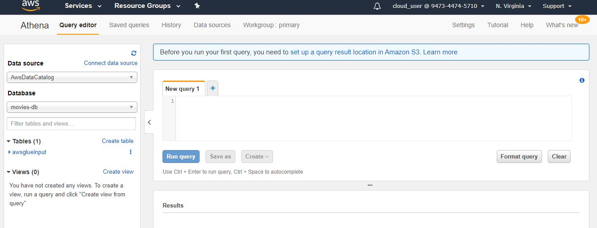
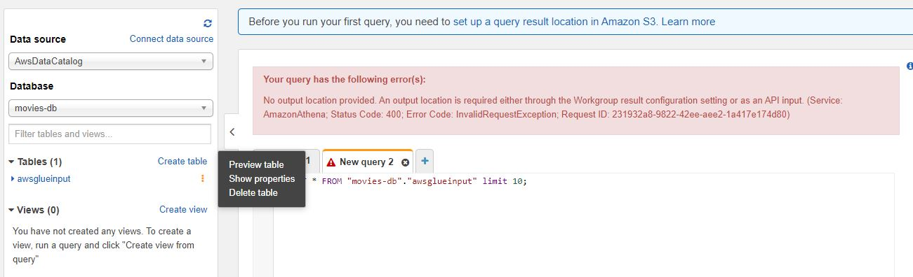
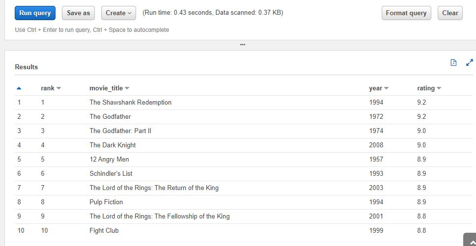
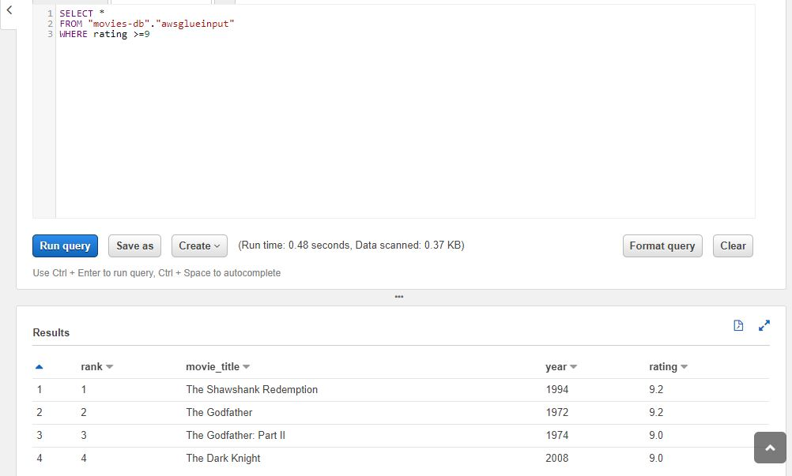

## Objective
This repository provides basic overview of usage of Athena to query objects stored in S3 via standard SQL

## Steps to Requisite
1) Load the movie dataset from S3 dataset folder in an S3 Bucket
2) Launch a crawler through Amazon Glue and create a table and database
3) In case you need help following steps 1 and 2, follow _01_Basic_ETL_pyspark_ from _AWS Glue_ Repository
4) Navigate to AWS Athena console

5) Generate a sample query by clicking preview table option as shown

6) In case you get an error like above, then set S3 bucket location to store query results by click link on the top or navigating to settings in Athena console as shown below

7) Output of the sample query will be displayed as below:

8) Lets now try to run a customized query on table to select all the movies with 9 or more rating

9) Output will be generated in the S3 bucket that we had set in step 6

