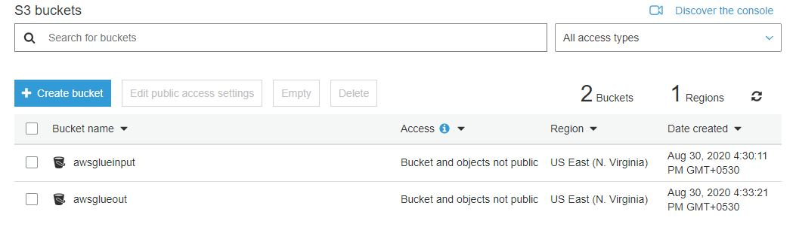
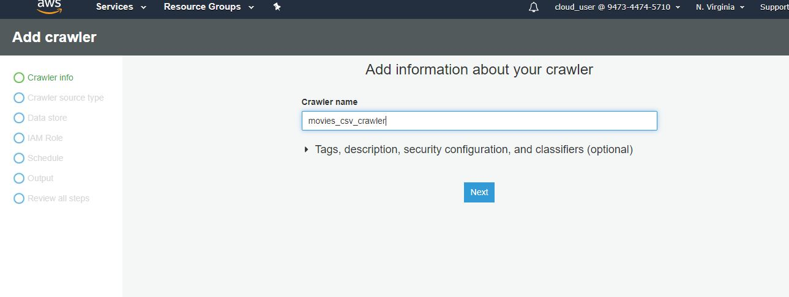
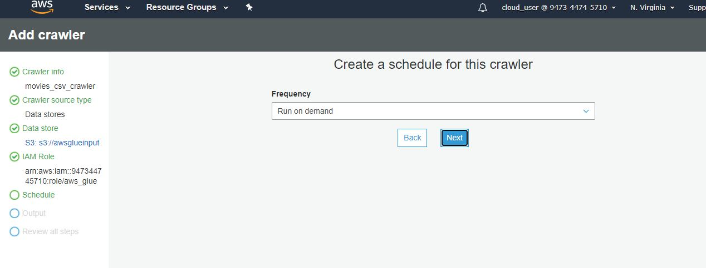
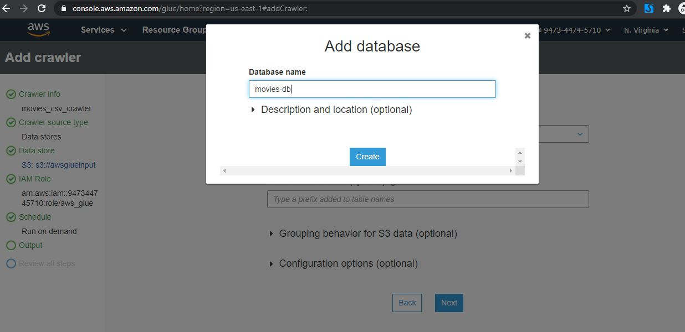
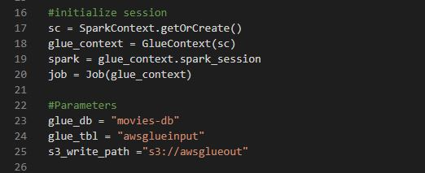
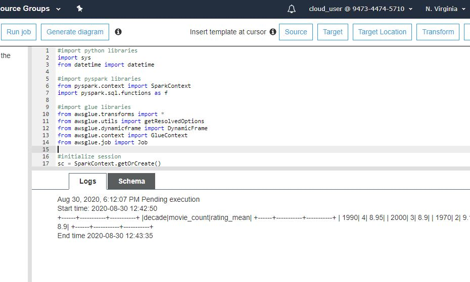
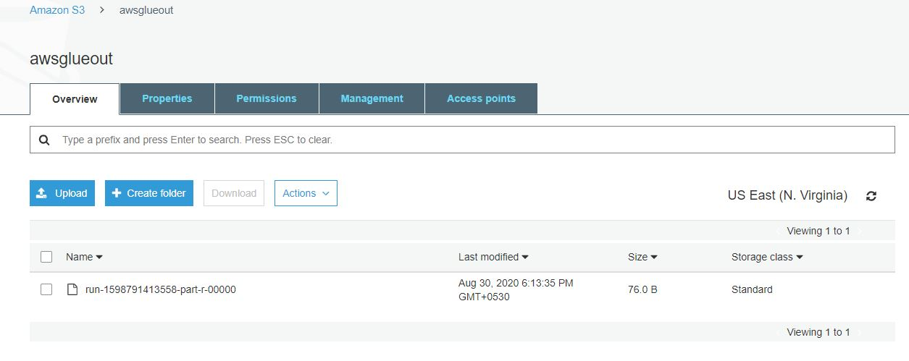

## Objective
This Repository is a sample test run on AWS Glue with some small dataset. We will see how we can use crawler to classify data types and create database and tables. Then we will write a custom Python script for perfroming some ETL Trannsformation and then storing it in our S3 output location.

Dataset that we are using is called movies. It consists of four features(columns):
- **rank:** describes the rank on IMDB list
- **movie_title:** name/ title of the movie
- **year:** year it was released
- **rating:** rating on IMDB

We will use pyspark to perform ETL and get output in three columns:
- **decade:** decade transfromed from the year column
- **movie_count:** number of movies in that decade
- **rating_mean:** mean rating for all the movies in that decade

## Pre-requisites
- Knowlegde of Python
- Indepth knowlege of pyspark datframes and pyspark sql functions 

### Steps to replicate
1) Clone the repository in your working directory
2) Create S3 input bucket and upload the dataset

3) Create and output S3 bucket so that we have both input and output buckets as follows:

4) Log in to AWS Glue console, create a crawler

- Define the source:

- Define the schedule as run on demand:

- Provide the database name for output and finally review the settings to create

5) Create a new job in jobs section with following settings and before that make you sure you have an IAM role with AWSGlue Sevice Role

6) Copy and Paste the custom script provided as _ETL.py_

- Make sure you have corrected the following parameters as defined in previous steps

7) Run the Job and check the output in console

8) Finally check the output file in S3 bucket

9) you can view the output file as a csv (as per output defination in script)

### First ETL via pyspark successfully perfromed
